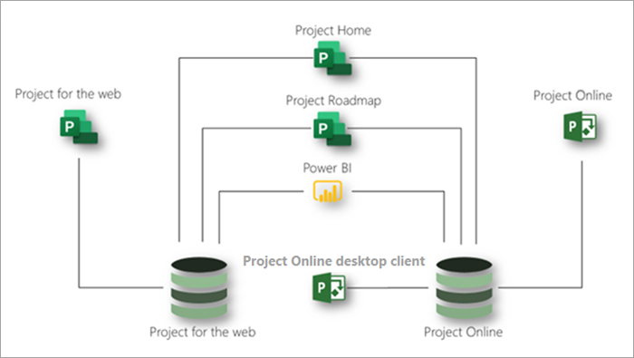

# Description du service Microsoft ProjectMicrosoft Project service description

## Vue d’ensembleOverview

Microsoft Project propose les applications suivantes pour vous aider à répondre aux besoins de votre organisation en matière de gestion des projets et des tâches :Microsoft Project offers the following applications to help meet your organization's needs for project and work management:

- Project pour le webProject for the web
- Project OnlineProject Online 
- Client de bureau Project OnlineProject Online desktop client

Cet article vous aidera à comprendre les applications fournies dans chaque abonnement de projet et les fonctionnalités offertes par chaque application.This article will help you understand which applications are provided in each Project subscription and what capabilities each application offers.

### Project pour le webProject for the web

Project pour le Web est l’offre la plus récente de Microsoft pour le travail informatique et la gestion de projet.Project for the web is Microsoft's most recent offering for cloud-based work and project management. Project pour le Web fournit des fonctionnalités de gestion des tâches simples et puissantes pour répondre à la plupart des besoins et des rôles.Project for the web provides simple, powerful work management capabilities to meet most needs and roles. Les chefs de projet et les membres de l’équipe peuvent utiliser Project pour le Web pour planifier et gérer le travail de n’importe quelle taille.Project managers and team members can use Project for the web to plan and manage work of any size.

Project pour le Web est basé sur la plateforme d’alimentation Microsoft.Project for the web is built on the Microsoft Power Platform. La plateforme Power se compose de PowerApp, Power automate, Power BI et du service de données commun (CD).The Power Platform consists of PowerApps, Power Automate, Power BI, and the Common Data Service (CDS). Project pour les données Web est stocké dans des CD.Project for the web data is stored in CDS. 

Project pour le Web est disponible par le biais de trois abonnements : plan de projet 1, plan de projet 3 et plan de projet 5.Project for the web is available through three subscriptions: Project Plan 1, Project Plan 3, and Project Plan 5. Les fonctionnalités indiquées dans la section [projet pour les fonctionnalités Web](#project-for-the-web-features) interagissent uniquement avec les données du projet pour le magasin de données Web.Features listed in the [Project for the web features](#project-for-the-web-features) section interact only with data in the Project for the web data store.

### Project OnlineProject Online
 
Project Online est une solution en ligne flexible pour la gestion de portefeuille de projets (PPM) et le travail quotidien.Project Online is a flexible online solution for Project Portfolio Management (PPM) and everyday work. Project Online offre des fonctionnalités de gestion de projet puissantes pour la planification, la hiérarchisation et la gestion des projets et des investissements &mdash; de portefeuille de projets à partir de quasiment n’importe quel appareil.Project Online provides powerful project management capabilities for planning, prioritizing, and managing projects and project portfolio investments&mdash;from almost anywhere on almost any device. Project Online peut être utilisé par les administrateurs, les gestionnaires et les visualiseurs de portefeuille, les gestionnaires de projets et de ressources, et les chefs et les membres d'équipe.Project Online can be used by administrators, portfolio managers and viewers, project and resource managers, and team leads and members.

Project Online est basé sur la plateforme SharePoint et stocke des données dans le magasin de données SharePoint.Project Online is built on the SharePoint platform, and it stores data in the SharePoint data store.

Project Online est disponible par le biais de deux abonnements : plan de projet 3 et plan de projet 5.Project Online is available through two subscriptions: Project Plan 3 and Project Plan 5. Les fonctionnalités indiquées dans la section [fonctionnalités de Project Online](#project-online-features) interagissent uniquement avec les données du magasin de données SharePoint de Project online.Features listed in the [Project Online features](#project-online-features) section interact only with data in the Project Online SharePoint data store.

La fonctionnalité de membre d’équipe pour Project Online est disponible via un abonnement Project Online Essentials.Team member functionality for Project Online is available through a Project Online Essentials subscription. Project Online Essentials est un *add-on*   abonnement de complément de membre d’équipe pour les clients qui ont prévu un abonnement plan de projet 3 ou plan de projet 5.Project Online Essentials is a team member *add-on* subscription for customers who have Project Plan 3 or Project Plan 5 subscriptions. Il donne aux membres de l’équipe une interface Web pour effectuer des mises à jour de tâches et de temps pour les projets gérés dans Project online.It gives team members a web interface to perform task and time updates to projects managed in Project Online.

Les membres de l’équipe avec Project Online Essentials peuvent effectuer les fonctions suivantes de Project Online :Team members with Project Online Essentials can perform the following Project Online functions:

- Utiliser une interface WebUse a web-based interface
- Mettre à jour des tâches, des problèmes et des risquesUpdate tasks, issues, and risks
- Soumettre des feuilles de tempsSubmit timesheets
- Partager des documents et collaborer avec des utilisateurs de Microsoft teams ou de Skype entrepriseShare documents and collaborate with Microsoft Teams or Skype for Business users

Project Online Essentials n’inclut pas Project pour le Web.Project Online Essentials does not include Project for the web.

### Client de bureau Project OnlineProject Online desktop client

Le client de bureau Microsoft Project Online est un programme de gestion de projets qui offre des fonctionnalités de planification automatisée, de gestion des ressources de projet et de création de rapports.Microsoft Project Online desktop client is a project management program that features automated scheduling, project resource management, and built-in reporting. Le client de bureau Project online peut être utilisé comme une application autonome ou il peut se connecter à Project online.Project Online desktop client can be used as a standalone application or it can connect to Project Online. Le client de bureau Project Online est la version d’abonnement du client de bureau Project professionnel et est disponible dans les abonnements plan de projet 3 et plan de projet 5.Project Online desktop client is the subscription version of the Project Professional desktop client and is available in Project Plan 3 and Project Plan 5 subscriptions.

### Utilisation conjointe de Project pour le Web et Project OnlineUsing Project for the web and Project Online together

Bien que Project pour le Web et Project Online soient des applications distinctes, vous pouvez les utiliser côte à côte.Although Project for the web and Project Online are separate applications, you can use them side-by-side. Vous pouvez voir tous vos projets dans les deux applications de la base de projets.You can see all your projects from both applications in Project Home. Vous pouvez utiliser la feuille de route de projet pour créer des feuilles de route qui incluent des projets des deux applications.You can use the Project Roadmap capability to build roadmaps that include projects from both applications. Vous pouvez utiliser Power BI et le projet pour le Pack de contenu Web Power BI pour obtenir des informations sur les projets et les ressources dans les deux applications. 3And you can use Power BI and the Project for the web Power BI content pack to gain insights into projects and resources across the two applications.3

Ce diagramme montre comment les applications peuvent travailler ensemble côte à côte.This diagram shows how the applications can work together side-by-side.

À l’avenir, Microsoft sera centré sur Project pour les innovations Web.Going forward, Microsoft will focus on Project for the web innovations. Toutefois, vous pouvez continuer à utiliser Project Online en toute confiance car elle continuera à recevoir des améliorations clés en matière de performances et de sécurité.However, you can continue using Project Online with confidence as it will continue to receive key performance and security improvements.

## Abonnements Microsoft ProjectMicrosoft Project subscriptions

Microsoft Project est disponible par le biais de trois abonnements différents pour répondre au mieux aux besoins de votre organisation.Microsoft Project is available through three different subscriptions to best meet the needs of your organization. Ces abonnements sont plan de projet 1, plan de projet 3 et plan de projet 5.These subscriptions are Project Plan 1, Project Plan 3, and Project Plan 5. Pour comparer les fonctionnalités entre les abonnements, consultez la rubrique [Feature Availability Across Applications and subscriptions](#feature-availability-across-applications-and-subscriptions).To compare features across subscriptions, see [Feature availability across applications and subscriptions](#feature-availability-across-applications-and-subscriptions).

|ProduitProduct | Offre 1Plan 1 | Plan 3Plan 3 | Plan 5Plan 5 |
|--------|-----------------------------|------------------------|------------------------|
|Project pour le webProject for the web |**x****x**  | **x x****x x** | **x x****x x** |
|Project OnlineProject Online | |**x x****x x**| **x x x****x x x** |
|Client de bureau Project OnlineProject Online desktop client | |**x****x**|**x****x**|

Dans le tableau ci-dessus, le nombre de contrôles (**x**) indique le niveau général des fonctionnalités fournies par un plan.In the table above, the number of checks (**x**) indicates the general level of capabilities provided by a plan. Par exemple, pour Project Online, plan 5 fournit davantage de fonctionnalités, puis prévoit 3.For example, for Project Online, Plan 5 provides more capabilities then Plan 3.

## Disponibilité des fonctionnalités pour les applications et les abonnementsFeature availability across applications and subscriptions

### Projet pour les fonctionnalités WebProject for the web features

Les fonctionnalités indiquées dans cette section interagissent uniquement avec les données du projet pour le magasin de données Web.Features listed in this section interact only with data in the Project for the web data store. Toutes ces fonctionnalités sont disponibles dans tous les abonnements Microsoft Project : plan de projet 1, plan de projet 3 et plan de projet 5.All these features are available in all Microsoft Project subscriptions: Project Plan 1, Project Plan 3, and Project Plan 5.

|FonctionnalitéFeature | DescriptionDescription | Licences Office 365Office 365 licenses | Offre 1Plan 1 | Plan 3Plan 3 | Plan 5Plan 5|
|--------|-----------------------------|--------------|------------|------------|------------|
|**Gestion du projet, des tâches et des heures****Project, task, and time management**||||||
|Vue de carteBoard view | Effectuez un suivi visuel des tâches de projet pour améliorer le flux de travail et la surveillance de l’État à l’aide de tableaux de tâches prédéfinis et personnalisés.Track project tasks visually for improved workflow and status monitoring by using out-of-the-box and custom task boards.| Afficher uniquementView only | OuiYes | OuiYes| OuiYes|
|DépendancesDependencies | Définir et suivre visuellement les dépendances entre les tâches.Set and visually track dependencies between tasks.| Afficher uniquementView only | OuiYes | OuiYes| OuiYes|
|Affichage grilleGrid view | Planifiez et gérez les projets à l’aide d’une vue de grille hiérarchique des tâches.Plan and manage projects by using a hierarchical grid view of tasks. | Afficher uniquementView only | OuiYes | OuiYes | OuiYes |
|JalonsMilestones | Établir et suivre les principaux jalons de projet et de tâche.Establish and track important project and task milestones.|Afficher uniquementView only | OuiYes | OuiYes | OuiYes |
|Accueil de projetProject Home | Suivre et gérer les livrables à l’aide des dates de début et de fin et de la planification automatisée.Track and manage deliverables using start and end dates and automated scheduling.| OuiYes | OuiYes | OuiYes | OuiYes |
|Planification des tâchesTask scheduling | Obtenez un aperçu des projets sur lesquels vous avez travaillé récemment, ainsi que des projets importants que vous devez surveiller en détail.Get a birds-eye view of projects that you've worked on recently, as well as important projects that you need to monitor closely.| Afficher uniquementView only | OuiYes | OuiYes | OuiYes |
|Affichage de la chronologie (diagramme de Gantt)Timeline view (Gantt chart) | Suivre et comprendre visuellement les dates de projet, les dépendances et les affectations dans une vue de chronologie hiérarchique.Visually track and understand project dates, dependencies, and assignments in a hierarchical timeline view.|Afficher uniquementView only | OuiYes | OuiYes | OuiYes |
|Tâches récapitulativesSummary tasks | Planifier, gérer et suivre les livrables et les phases à l’aide de tâches récapitulatives.Plan, manage, and track deliverables and phases by using summary tasks.| Afficher uniquementView only | OuiYes | OuiYes | OuiYes |
|**Collaboration****Collaboration** ||||||
|Intégration de Microsoft teamsMicrosoft Teams integration | Collaborer sur des projets dans Microsoft Teams. 1Collaborate on projects in Microsoft Teams.1 | OuiYes | OuiYes | OuiYes | OuiYes |
|**Gestion des ressources et des programmes****Resource and program management** ||||||
|Configuration de l’équipe de projetProject team setup | Gérer une équipe de projet en ajoutant et en supprimant des membres et en définissant le calendrier de travail.Manage a project team by adding and removing members and setting the working calendar. | NonNo | OuiYes | OuiYes | OuiYes |
|Feuilles de routeRoadmaps | Créez des feuilles de route interactives et visuelles dans les projets à partir de Microsoft Project Online, de Microsoft Project pour le Web et des projets de forums Azure. 2   Avec le plan de projet 1, vous disposez d’un accès en lecture seule aux feuilles de route.Build visual, interactive roadmaps across projects from Microsoft Project Online, Microsoft Project for the web, and Azure Boards projects.2 With Project Plan 1 you get read-only access to roadmaps. Avec le plan de projet 3 ou le plan de projet 5, vous pouvez également créer des feuilles de route.With Project Plan 3 or Project Plan 5 you can also create roadmaps. | Afficher seulementView only | Afficher seulementView only | OuiYes | OuiYes |
|**Rapports**3**Reporting**3 ||||||
|Rapports prédéfinisOut-of-the-box reporting | Utilisez des rapports prédéfinis pour comprendre les données de projet, de programme, de portefeuille et de ressources.Use pre-built reports to understand project, program, portfolio, and resource data. | NonNo | OuiYes | OuiYes | OuiYes |
|Rapports personnalisésCustom reports | Comprenez les données importantes pour votre organisation en créant des rapports personnalisés basés sur des rapports prédéfinis ou à partir de zéro.Understand the data important to your organization by building custom reports based on out-of-the-box reports or from scratch. | NonNo | OuiYes | OuiYes | OuiYes |
|Tableaux de bord et portailsDashboards and portals | Créez des portails et des tableaux de bord personnalisés pour répondre aux besoins spécifiques de votre organisation.Build custom dashboards and portals to help meet specific organizational needs.| NonNo | OuiYes | OuiYes | OuiYes |
|**Facilement****Usability** ||||||
|Co-créationCoauthoring | Collaborez avec les parties prenantes et les membres de l’équipe pour créer, modifier et mettre à jour simultanément des listes de tâches, des planifications de projets et bien plus encore.Work together with stakeholders and team members to simultaneously build, edit, and update task lists, project schedules, and more.| Afficher uniquementView only | OuiYes | OuiYes | OuiYes |
|Indicateurs graphiquesGraphical indicators | Comprendre l’état des tâches, les affectations et bien plus encore avec des indicateurs graphiques.Understand task status, assignments, and more with graphical indicators.| Afficher uniquementView only | OuiYes | OuiYes | OuiYes |
|**Mobilité****Mobility** ||||||
|Applications mobilesMobile applications | Créez des applications mobiles personnalisées avec les PowerApp. 4Build custom mobile applications with PowerApps.4 |NonNo | NonNo | OuiYes | OuiYes |
|**Personnalisation et intégration****Customization and integration**||||||
|PowerAppsPowerApps | Créez et consommez des solutions pour le Web et les appareils mobiles avec les PowerApp. 4Build and consume solutions for web and mobile with PowerApps.4 | NonNo | NonNo | OuiYes | OuiYes |
|Flux de travailWorkflows | Automatisez et intégrez les processus d’entreprise avec Power Automated. 5Automate and integrate business processes with Power Automate.5 | NonNo | NonNo | OuiYes | OuiYes |
|Intégration MicrosoftMicrosoft integration | Collaborer, gérer des documents et plus encore à l’aide d’outils et d’applications Microsoft familiers. 1Collaborate, manage documents, and more by using familiar Microsoft tools and applications.1 | OuiYes | OuiYes | OuiYes | OuiYes |
|**Gestion des utilisateurs et de la sécurité****Security and user management**||||||
|Groupes modernes OfficeOffice Modern Groups | Créez une équipe de projet pour collaborer et configurer facilement une collection de ressources que les membres de l’équipe partagent.Build a project team to collaborate with and easily set up a collection of resources for team members to share. | OuiYes | OuiYes | OuiYes | OuiYes |

### Fonctionnalités de Project OnlineProject Online features

Les fonctionnalités indiquées dans cette section interagissent uniquement avec les données du magasin de données SharePoint Online.Features listed in this section interact only with data in the Project Online SharePoint data store.

|FonctionnalitéFeature | DescriptionDescription | Plan de projet 3Project Plan 3 | Plan de projet 5Project Plan 5 |
|--------|-------------|-----------------------------|------------------------|
|**Gestion du projet, des tâches et des heures****Project, task, and time management**||||
|Alertes et rappelsAlerts and reminders | Restez informé de la planification des tâches à venir importantes et des événements de projet avec les rappels dans Outlook et Microsoft Teams. 1Stay on schedule for important upcoming tasks and project events with reminders in Outlook and Microsoft Teams.1| OuiYes | OuiYes |
|LignesBaselines | Définir des planifications de projet pour surveiller les performances actuelles par rapport aux performances passées à l’aide de Project Web App.Set project baselines to monitor current performance against past performance using the Project Web App.| OuiYes | OuiYes |
|Vue de carteBoard view | Suivez visuellement les tâches de projet pour améliorer le flux de travail et la surveillance de l’État.Visually track project tasks for improved workflow and status monitoring. | OuiYes | OuiYes |
|Chemin critiqueCritical path | Suivez visuellement les tâches qui représentent le chemin le plus long dans le projet à l’aide de Project Web App.Visually track the tasks that represent the longest path through the project using the Project Web App.| OuiYes | OuiYes |
|Gestion des livrablesDeliverable management | Suivre et gérer les livrables à l’aide des dates de début et de fin et de la planification automatisée.Track and manage deliverables using start and end dates and automated scheduling.| OuiYes | OuiYes |
|DépendancesDependencies | Définir et suivre visuellement les dépendances entre les tâches.Set and visually track dependencies between tasks.| OuiYes | OuiYes |
|Affichage GanttGantt view | Suivre et comprendre visuellement les dates, les dépendances et les affectations d’un projet à l’aide de Project Web App.Visually track and understand project dates, dependencies, and assignments on a hierarchical Gantt chart using the Project Web App.| OuiYes | OuiYes |
|Affichage grilleGrid view | Planifier et gérer des projets à l’aide d’une vue de grille hiérarchique des tâches à l’aide de Project Web App.Plan and manage projects using a hierarchical grid view of tasks using the Project Web App.| OuiYes | OuiYes |
|Gestion des problèmes et des risquesIssue and risk management | Identifiez et effectuez le suivi des problèmes et des risques au niveau du projet et de la tâche.Identify and track issues and risks at the project and task level.| OuiYes | OuiYes |
|Projets maîtres Master projects | Regroupez les projets connexes plus petits sous un seul projet principal à l’aide de Project Web App.Group smaller related projects under a single master project using the Project Web App. | OuiYes | OuiYes |
|NotificationsNotifications | Restez informé des affectations de tâches, des États et des événements de projet importants avec des notifications Outlook et Teams. 1Stay on top of task assignments, status, and important project events with Outlook and Teams notifications.1 | OuiYes | OuiYes |
|Accueil de projetProject Home | Obtenez un aperçu des projets sur lesquels vous avez travaillé récemment, ainsi que des projets importants que vous devez surveiller en détail.Get a birds-eye view of projects that you've worked on recently, as well as important projects that you need to monitor closely.| OuiYes | OuiYes |
|Gestion des versions de projetProject versioning | Comparez les différentes versions d’un projet avec un rapport qui indique ce qui a changé entre les versions.Compare different versions of a project with a report that shows what changed between versions. | OuiYes | OuiYes |
|Tâches récapitulativesSummary tasks | Planifier, gérer et suivre les livrables et les phases à l’aide de tâches récapitulatives dans Project Web App.Plan, manage, and track deliverables and phases using summary tasks in the Project Web App. | OuiYes | OuiYes |
|Planification des tâchesTask scheduling | Utilisez les dates de début et de fin de la tâche, les efforts, le travail, les temps d’avance et de retard, ainsi que les dépendances pour obtenir un calendrier précis des dates de projet à l’aide de Project Web App.Use task start and end dates, effort, work, lead and lag times, and dependencies to get an accurate schedule of project dates using the Project Web App. | OuiYes | OuiYes |
|Mises à jour de tâchesTask updates | Capturer le temps et l’état avec des commentaires sur les tâches de projet, le travail hors projet et le temps non travaillé.Capture time and status with comments on project tasks, non-project work, and non-working time. | OuiYes | OuiYes |
|ChronologiesTimelines | Suivre et comprendre visuellement les dates, les dépendances et les affectations d’un projet à l’aide de Project Web App.Visually track and understand project dates, dependencies, and assignments on a timeline view using the Project Web App. | OuiYes | OuiYes |
|Feuilles de tempsTimesheets | Les membres de l’équipe peuvent entrer le temps et l’état des tâches, le travail hors projet et les périodes chômées.Team members can enter time and status against tasks, non-project work, and non-working time. | OuiYes | OuiYes |
|Approbations des feuilles de tempsTimesheet approvals | Les membres de l’équipe peuvent envoyer des feuilles de temps pour approbation.Team members can submit timesheets for approval. Les responsables de ressources et les superviseurs peuvent consulter, approuver et décliner les feuilles de temps soumises.Resource managers and supervisors can review, approve, and decline submitted timesheets. | OuiYes | OuiYes |
|Configuration de l’heure hors travailNon-working time setup | Ajoutez des vacances, des jours fériés, des arrêts de travail et d'autres périodes chômées au planning de votre projet.Add vacation, holidays, medical leave, and other nonworking time into your project schedule. | NonNo | OuiYes |
|**Collaboration****Collaboration** ||||
|Pièces jointesAttachments | Joindre des documents, des images et d’autres fichiers au niveau de l’équipe, du projet ou de la tâche.Attach documents, images, and other files at the team, project, or task level. Gérer ces pièces jointes dans une bibliothèque centrale au niveau de l’équipe ou du projet.Manage these attachments in a central library at the team or project level. | OuiYes | OuiYes |
|Membres de l’équipe externeExternal team members |Collaborez avec des personnes en dehors de votre organisation en leur accordant l’accès à vos projets, tâches et documents. 6Collaborate with people from outside of your organization by granting them access to view and interact with your projects, tasks, and documents.6 | OuiYes | OuiYes |
|Sites de projetProject sites | Créer et personnaliser un concentrateur pour la collaboration et les documents pour un projet.Create and customize a hub for collaboration and documents for a project. | OuiYes | OuiYes |
Intégration de Microsoft teamsMicrosoft Teams integration | Collaborer sur des projets dans Microsoft Teams. 1Collaborate on projects in Microsoft Teams.1 | OuiYes | OuiYes |
|**Gestion de la demande****Demand management** ||||
|Configuration du flux de travail approbation de projetProject request approval workflow setup | Créez les flux de travail dont vous avez besoin pour évaluer, classer par priorité et approuver la demande entrante.Build the workflows you need to evaluate, prioritize, and approve incoming demand. | NonNo | OuiYes |
|Création de formulaires de demande de projetProject request forms creation | Capturez les données importantes relatives à la demande entrante afin de vous aider à évaluer et à hiérarchiser le nouveau travail.Capture important data about incoming demand to help you evaluate and prioritize new work. | NonNo | OuiYes |
|Demandes de projetProject requests | Suivre, gérer, évaluer et hiérarchiser la demande entrante à partir de votre organisation et des clients et partenaires externes.Track, manage, evaluate, and prioritize incoming demand from within your organization and from external customers and partners. | OuiYes | OuiYes |
|**Gestion des ressources, des programmes et des portefeuilles****Resource, program, and portfolio management** ||||
|Coûts et budgétisation du projetProject costing and budgeting | Comparez l’avancement et le budget planifiés avec le temps et les coûts réels à l’aide de Project Web App.Compare planned progress and budget against actual time and costs using the Project Web App. | OuiYes | OuiYes |
|Configuration de l’équipe de projetProject team setup | Gérer une équipe de projet en ajoutant et en supprimant des membres, en définissant des niveaux de répartition et en ajoutant des membres externes.Manage a project team by adding and removing members, setting allocation levels, and adding external members. | OuiYes | OuiYes |
|Affichages capacité des ressourcesResource capacity views | Effectuer le suivi et la gestion de la capacité des ressources au niveau du projet, de l’équipe et de l’organisation.Track and manage resource capacity at the project, team, and organization level. | OuiYes | OuiYes |
|Coût des ressourcesResource costing | Suivez et gérez les coûts des ressources de votre projet.Track and manage the resource costs of your project. | OuiYes | OuiYes |
|Engagements de ressources (réservations)Resource engagements (bookings) | Les responsables de projets peuvent soumettre des demandes de ressources par rôle, compétences ou nom.Project managers can submit requests for resources by role, skills, or name. Les responsables de ressources peuvent consulter les demandes et affecter les meilleures ressources disponibles.Resource managers can review requests and assign the best resources available. |Oui7Yes7 | Oui8Yes8 |
|Planification de la capacité des ressourcesResource capacity planning | Effectuer le suivi et la gestion de la capacité des ressources au niveau du projet, de l’équipe et de l’organisation.Track and manage resource capacity at the project, team, and organization level. | NonNo | OuiYes |
|Feuilles de routeRoadmaps | Créez des feuilles de route interactives et visuelles dans les projets à partir de Microsoft Project Online, de Microsoft Project pour le Web et des projets de forums Azure. 2Build visual, interactive roadmaps across projects from Microsoft Project Online, Microsoft Project for the web, and Azure Boards projects.2 | OuiYes | OuiYes |
|Analyse de portefeuille et définition des prioritésPortfolio analysis and prioritization | Identifiez, sélectionnez et proposez des portefeuilles de projets qui correspondent le mieux à la stratégie d’entreprise de votre organisation et optimisez votre retour sur investissement.Identify, select, and deliver project portfolios that best align with your organization's business strategy and maximize your return on investment (ROI). | NonNo | OuiYes |
|Tableaux de bord/portailsDashboards/portals | Comprendre l’État, la définition des priorités et bien plus encore au niveau des portefeuilles, des programmes, des projets, des tâches, des équipes et des ressources avec des tableaux de bord interactifs en temps réel.Understand status, prioritization, and more at the portfolio, program, project, task, team, and resource level with real-time interactive dashboards. | OuiYes | OuiYes |
|Work, generic, and material resourcesWork, generic, and material resources | Ajoutez des ressources à un projet, telles que des ressources professionnelles comme des personnes, des ressources génériques comme des charpentiers et des ressources matérielles comme des ordinateurs et du ciment.Add resources to a project, such as work resources like people, generic resources like carpenters, and materials resources like computers and cement. | OuiYes | OuiYes |
|**Rapports**3**Reporting**3 ||||
|Rapports prédéfinisOut-of-box reporting | Utilisez des rapports prédéfinis pour comprendre les données de projet, de programme, de portefeuille et de ressources.Use pre-built reports to understand project, program, portfolio, and resource data. | OuiYes | OuiYes |
|Rapports personnalisésCustom reports | Comprenez les données importantes pour votre organisation en générant des rapports personnalisés basés sur des rapports prédéfinis ou à partir de zéro.Understand the data important to your organization by building custom reports based on out-of-box reports or from scratch. | OuiYes | OuiYes |
|Tableaux de bord et portailsDashboards and portals | Créez des portails et des tableaux de bord personnalisés pour répondre aux besoins spécifiques de votre organisation.Build custom dashboards and portals to help meet specific organizational needs. | OuiYes | OuiYes |
|**Personnalisation et intégration****Customization and integration**||||
|Marque personnaliséeCustom branding | Personnalisez votre déploiement de projet à l’aide de votre propre marque, logo et couleurs.Customize your Project deployment using your own brand, logo, and colors. | NonNo | OuiYes |
|Custom fieldsCustom fields | Ajoutez des champs personnalisés au niveau du projet, de la tâche et des ressources pour effectuer le suivi des données importantes pour votre organisation et vos projets.Add custom fields at the project, task, and resource level to track data important to your organization and projects. | OuiYes | OuiYes |
|FormulesFormulas | Calculer et capturer des données importantes à l’aide de formules entre des tâches et des projets.Calculate and capture important data using formulas across tasks and projects. | OuiYes | OuiYes |
|PowerAppsPowerApps | Créez et consommez des solutions pour le Web et les appareils mobiles (via OData) avec les PowerApp. 4Build and consume solutions for web and mobile (through OData) with PowerApps.4 | OuiYes | OuiYes |
|Flux de travailWorkflows | Automatisez et intégrez les processus d’entreprise (via OData) avec Power Automated. 5Automate and integrate business processes (through OData) with Power Automate.5 | OuiYes | OuiYes |
|Intégration de Microsoft 365Microsoft 365 integration | Collaborer, gérer des documents et plus d’informations à l’aide d’outils et d’applications Microsoft familiers. 1Collaborate, manage documents, and more using familiar Microsoft tools and applications.1 | OuiYes | OuiYes |
|Intégration du planificateur MicrosoftMicrosoft Planner integration | Connecter des tâches de projet à un plan de planificateur et suivre le travail détaillé dans le planificateur. 1Connect Project tasks to a Planner plan and track detailed work in Planner.1 | OuiYes | OuiYes |
|**Gestion de la sécurité, des utilisateurs et des services****Security, user, and service management**||||
|Active Directory integrationActive Directory integration | Créez des équipes à partir de n’importe quel membre de l’annuaire Active Directory de votre organisation. 9Build teams from any member of your organization's Active Directory.9 | OuiYes | OuiYes |
|Gestion des utilisateursUser management | Gérer les rôles et les autorisations des utilisateurs et des groupes au niveau du projet, de l’équipe et de l’organisation.Manage user and group roles and permissions at the project, team, and organization level. | NonNo | OuiYes |
|Administration des servicesService administration | Planifiez, installez et configurez, gérez et étendez votre environnement Microsoft Project dans le cadre de votre environnement Office 3651 .Plan, install and configure, maintain, and extend your Microsoft Project environment as part of your Office 3651 environment.  | NonNo | OuiYes |

#### NotesNotes

1 nécessite un abonnement commercial Office ou Microsoft 365.1 Requires an Office or Microsoft 365 commercial subscription. 
2 cartes Azure acquises séparément.2 Azure Boards acquired separately. 
3 la création de rapports pour Project pour le Web et Project Online est disponible à l’aide de Power bi.3 Reporting for Project for the web and Project Online is available by using Power BI. L’affichage, la modification et la création de rapports nécessitent un abonnement Power BI.Viewing, editing, and creating reports requires a Power BI subscription. Microsoft fournit un ensemble prédéfini de rapports Power BI.Microsoft provides a pre-built set of Power BI reports. Les utilisateurs peuvent personnaliser ces rapports ou créer des rapports supplémentaires à l’aide de Power BI.Users can customize these reports or build additional reports using Power BI.  
4 la création et l’utilisation d’applications mobiles powerapples personnalisées qui accèdent à Project pour les données Web nécessitent un abonnement powerapps et un abonnement Project Plan 3 ou Project plan 5. 
4 Building and using custom PowerApps mobile applications that access Project for the web data requires a PowerApps subscription and a Project Plan 3 or Project Plan 5 subscription. 
5 l’automatisation et l’intégration de processus d’entreprise avec Power Automated with Project for the Web Data nécessitent un abonnement Power Automated et un abonnement plan Project 3 ou Project plan 5.5 Automating and integrating business processes with Power Automate with Project for the web data requires a Power Automate subscription and a Project Plan 3 or Project Plan 5 subscription. 
6 la gestion des licences Project Online pour les utilisateurs externes suit la même stratégie que pour les utilisateurs internes.6 Project Online licensing for external users follows the same policy as that for internal users. Toute interaction sur un site Project Online nécessite un abonnement de plan de projet 3 ou de plan de projet 5.Any interaction on a Project Online site requires a Project Plan 3 or Project Plan 5 subscription. 
7 les utilisateurs disposant d’un abonnement de plan de projet 3 ou de plan de projet 5 peuvent soumettre des demandes d’engagement de ressources.7 Users with a Project Plan 3 or Project Plan 5 subscription can submit resource engagement requests. Ils ne peuvent pas consulter, combler ou approuver les demandes d’engagement de ressources.They cannot review, fulfill, or approve resource engagement requests. 
8 les utilisateurs disposant d’un abonnement à un plan de projet 5 peuvent consulter, combler et approuver les demandes d’engagement de ressources.8 Users with a Project Plan 5 subscription can review, fulfill, and approve resource engagement requests. 
9 Active Directory nécessite un abonnement distinct.9 Active Directory requires a separate subscription.  

### Fonctionnalités de client de bureau Project OnlineProject Online desktop client features

|FonctionnalitéFeature | DescriptionDescription |
|--------|-------------|
|**Gestion des projets et des tâches****Project and task management**||
|LignesBaselines | Définir des planifications de projet pour surveiller les performances actuelles par rapport aux performances passées.Set project baselines to monitor current performance against past performance. |
|Mode CalendrierCalendar view | Effectuez le suivi des délais et des échéances importants pour les projets et les tâches dans un affichage de calendrier hebdomadaire ou mensuel.Track important project and task deadlines and milestones on a weekly or monthly calendar view. |
|Chemin critiqueCritical path | Suivez visuellement les tâches qui représentent le chemin le plus long dans le projet.Visually track the tasks that represent the longest path through the project. |
|DélaisDeadlines | Établir et suivre les échéances importantes du projet et de la tâche.Establish and track important project and task deadlines. |
|DépendancesDependencies | Définir et suivre visuellement les dépendances entre les tâches.Set and visually track dependencies between tasks. |
|Affichage GanttGantt view | Suivre et comprendre visuellement les dates, les dépendances et les affectations d’un projet dans un affichage Gantt hiérarchique.Visually track and understand project dates, dependencies, and assignments in a hierarchical Gantt view. |
|Affichage grilleGrid view | Planifier et gérer des projets à l’aide d’une vue de grille hiérarchique des tâches.Plan and manage projects using a hierarchical grid view of tasks. |
|Projets maîtres Master projects | Regroupez les projets connexes plus petits sous un seul projet principal.Group smaller related projects under a single master project. |
|JalonsMilestones | Établir et suivre les principaux jalons de projet et de tâche.Establish and track important project and task milestones. |
|Diagramme de réseauNetwork diagram | Affichez les tâches, les dépendances et le chemin critique de votre projet dans un affichage réseau de tâches.View tasks, dependencies, and the critical path of your project in a network diagram view. |
|Planification des tâchesTask scheduling | Utilisation des dates de début et de fin de la tâche, des efforts, du travail, des temps d’avance et de retard, ainsi que des dépendances pour obtenir un calendrier précis des dates de projetUse task start and end dates, effort, work, lead and lag times, and dependencies to get an accurate schedule of project dates |
|Planificateur d’équipeTeam planner | Suivre l’allocation et la capacité de tous les membres de l’équipe du projet, y compris le travail hors projet et les périodes chômées.Track the allocation and capacity of all project team members, including non-project work and non-working time.|
|ChronologiesTimelines | Suivez et comprenez visuellement les dates de projet, les dépendances et les affectations dans un affichage chronologie.Visually track and understand project dates, dependencies, and assignments in a timeline view. |
|Tâches inactivesInactive tasks | Utiliser les tâches inactives pour suivre le travail sans affecter la disponibilité ou l’allocation des ressources et sans affecter la planification du projet.Use inactive tasks to track work without affecting resource availability or allocation and without affecting the project schedule. |
|Tâches récapitulativesSummary tasks | Planifier, gérer et suivre les livrables et les phases à l’aide de tâches récapitulatives.Plan, manage, and track deliverables and phases using summary tasks. |
|Inspecteur de tâchesTask inspector | Affichez les facteurs qui influent sur la planification d’une tâche, tels que la modification de la date de début ou les messages d’erreur.View factors that affect the scheduling of a task, such as a changed start date or error messages. |
|Analyse du chemin des tâchesTask path analysis | Visualisez la façon dont une tâche est associée à d'autres en surlignant la séquence des tâches tout au long du projet.See how one task connects to other tasks by highlighting its task path throughout the project. |
|**Gestion des ressources et de l’état financier****Resource and financial management**||
|Audit des ressourcesResource leveling | Résoudre les conflits de ressources ou les surutilisations en auditant automatiquement les affectations.Resolve resource conflicts or overallocations by automatically leveling the assignments. |
|Ressources de travail, générales et matériellesWork, generic, and material resources | Ajoutez des ressources à un projet, telles que des ressources professionnelles comme des personnes, des ressources génériques comme des charpentiers et des ressources matérielles comme des ordinateurs et du ciment.Add resources to a project, such as work resources like people, generic resources like carpenters, and materials resources like computers and cement. |
|Coûts et budgétisation du projetProject costing and budgeting | Comparez l’avancement et le budget planifiés au temps et au coût réels.Compare planned progress and budget to actual time and costs. |
|Coût des ressourcesResource costing | Suivez et gérez les coûts des ressources de votre projet.Track and manage the resource costs of your project.|
|**Rapports****Reporting** ||
|Rapports personnalisésCustom reports | Créer des rapports personnalisés pour des projets, des programmes, des portefeuilles et des ressources.Build custom reports for projects, programs, portfolios, and resources. |
|Rapports prédéfinisOut-of-box reporting | Utilisez des rapports prédéfinis pour comprendre les données de projet, de programme, de portefeuille et de ressources.Use pre-built reports to understand project, program, portfolio, and resource data. |
|Sortie PDF et XPSPDF and XPS output | Enregistrez un fichier de projet au format PDF ou XPS.Save a Project file as a PDF or XPS file. |
|**Facilement****Usability**||
|Saisie semi-automatiqueAuto-complete | Obtenir des suggestions pour les noms de tâches ou de ressources et les dépendances à mesure que vous tapez.Get suggestions for task or resource names and dependencies as you type. |
|Vues filtréesFiltered views | Filtrer les plans de projet en n’importe quelle valeur dans le planFilter project plans by any value in the plan |
|Indicateurs graphiquesGraphical indicators | Comprendre l’état des tâches, les affectations et bien plus encore avec des indicateurs graphiques.Understand task status, assignments, and more with graphical indicators. |
|Annulation à plusieurs niveauxMulti-level undo | Annulez plusieurs modifications en même temps à l’aide du menu **Annuler** .Undo multiple changes at the same time by using the **Undo** menu. |
|Tri et regroupementSorting and grouping | Utilisez le tri et le regroupement personnalisés pour obtenir une vue prioritaire de votre projet, des tâches et des ressources.Use custom sorting and grouping to get a focused view of your project, tasks, and resources.|
|**Personnalisation et intégration****Customization and integration**||
|Champs personnalisésCustom fields | Ajoutez des champs personnalisés au niveau du projet, de la tâche et des ressources pour effectuer le suivi des données importantes pour votre organisation et vos projets.Add custom fields at the project, task, and resource level to track data important to your organization and projects. |
|FormulairesForms | Créez et déployez des formulaires personnalisés pour capturer des données de projet importantes.Create and deploy custom forms to capture important project data. |
|FormulesFormulas | Calculer et capturer des données importantes à l’aide de formules entre des tâches et des projets.Calculate and capture important data using formulas across tasks and projects. |
|ModèlesTemplates | Créez des modèles pour les projets courants, notamment les plans de projet, les équipes et les devoirs.Create templates for common projects including project plans, teams, and assignments. |
|importation/exportation. mpp.mpp import/export | Créez de nouveaux projets à partir de fichiers. mpp existants ou créez un fichier. mpp d’un projet existant.Create new projects from existing .mpp files or create an .mpp file of an existing project. |
|Importation/exportation ExcelExcel import/export | Créez de nouveaux projets à partir de fichiers Excel ou créez un fichier Excel d’un projet existant.Create new projects from Excel files or create an Excel file of an existing project. |

## Considérations relatives aux servicesService considerations

> [!NOTE]
> Le projet pour le Web est actuellement indisponible pour GCC, GCC High et DoD.Project for the web is currently unavailable for GCC, GCC High, and DoD. Nous travaillons sur la remise d’un projet pour le Web, mais vous ne pouvez pas partager un créneau horaire pour le moment.We're working on delivering Project for the web to you but are unable to share a firm timeframe at this time.

### Remarques sur les licencesLicensing considerations

- Toute interaction sur un site Project Online nécessite un abonnement de plan de projet 3 ou de plan de projet 5.Any interaction on a Project Online site requires a Project Plan 3 or Project Plan 5 subscription.
- Lorsque votre dernier abonnement de plan de projet 1, de plan de projet 3 ou de plan de projet 5 expire, votre projet pour les instances Web est supprimé après 120 jours.When your last Project Plan 1, Project Plan 3, or Project Plan 5 subscription expires, your Project for the web instances will be deleted after 120 days.
- Lorsque votre dernier abonnement de plan de projet 3 ou de plan de projet 5 expire, vos instances de Project Online seront supprimées après 120 jours.When your last Project Plan 3 or Project Plan 5 subscription expires, your Project Online instances will be deleted after 120 days.
- Pour Project pour les abonnements d’évaluation Project Online et Web, vos instances d’évaluation seront supprimées 30 jours après la fin de la période d’évaluation.For Project for the web and Project Online trial subscriptions, your trial instances will be deleted 30 days after your trial period ends.

### Utilisation de SharePoint OnlineUse of SharePoint Online

Project Online nécessite l’utilisation de SharePoint Online, qui est mis en service dans le cadre de Project online.Project Online requires the use of SharePoint Online, which is provisioned as part of Project Online. Les droits d’accès aux fonctionnalités SharePoint Online fournis avec le plan de projet 3 ou les abonnements de plan de projet 5 sont limités au stockage et à l’accès aux données pour prendre en charge Project online.Rights to the SharePoint Online functionality provided with Project Plan 3 or Project Plan 5 subscriptions are limited to storing and accessing data to support Project Online.

### Feuille de route et automate de puissance de projetProject Roadmap and Power Automate

La feuille de route de projet requiert l’utilisation de Power automate, qui est configurée dans le cadre de votre abonnement à votre projet.Project Roadmap requires the use of Power Automate, which is provisioned as part of your Project subscription. Les droits de fonctionnement de la fonctionnalité automatique sont limités à ceux des fonctionnalités automatiques requises par la feuille de route Project.Rights to Power Automate functionality are limited to those Power Automate capabilities required by Project Roadmap. Power automatiser les fonctionnalités requises par Project la feuille de route s’affiche en tant que l' **intégration de données pour Project avec** le plan de service de flux dans la section **applications** du centre d’administration 365 de Microsoft.Power Automate functionality required by Project Roadmap appears as the **Data Integration for Project with Flow** service plan in the **Apps** section of the Microsoft 365 admin center.

### Projet pour le Web et le service de données communProject for the web and Common Data Service

Project pour le Web nécessite l’utilisation du CD (Common Data Service) pour stocker ses données.Project for the web requires the use of the Common Data Service (CDS) for storing its data. Les CD sont mis en service dans le cadre de votre abonnement au projet.CDS is provisioned as part of your Project subscription. Les fonctionnalités de droits sur les CD sont limitées au stockage et à l’accès aux données pour prendre en charge Project pour le Web.Rights to CDS functionality are limited to storing and accessing data to support Project for the web. Les fonctionnalités de CD requises par Project apparaissent comme le **service de données commun pour** le plan de service Project dans la section **applications** du centre d’administration 365 de Microsoft.CDS functionality required by Project appears as the **Common Data Service for Project** service plan in the **Apps** section of the Microsoft 365 admin center.

### Sauvegarde et rétention des donnéesData backup and retention

Project pour le Web et Project Online possèdent les mêmes stratégies de sauvegarde et de rétention des données que Office 365.Project for the web and Project Online both have the same data backup and retention policy as Office 365. Pour plus d’informations, consultez la rubrique relative à la [rétention, la suppression et la destruction des données dans Office 365](https://docs.microsoft.com/office365/Enterprise/office-365-data-retention-deletion-and-destruction-overview).For details, see [Data Retention, Deletion, and Destruction in Office 365](https://docs.microsoft.com/office365/Enterprise/office-365-data-retention-deletion-and-destruction-overview).

### Projet pour les limites et limites du site WebProject for the web boundaries and limitations

Project pour le Web présente certaines limitations, décrites dans le tableau suivant.Project for the web has some limitations, which are described in the following table.

|Entité/champEntity/field | LimiteLimit |
|-------------|-------|
|**Tâche****Task** ||
|LongueurMax. niveau hiérarchique de la tâchehierarchy level for task | 10 niveaux10 levels |
|LongueurMax. Liens (successeur + prédécesseur) d’une tâchelinks (successor + predecessor) for a task | vingtaine20 |
|LongueurMax. durée de la tâche terminalduration of leaf task | 1250 jours1250 days |
|LongueurMax. durée de la tâche récapitulativeduration of summary task | 3650 jours (10 ans)3650 days (10 years) |
|LongueurMax. ressources pouvant être affectées à une tâcheresources that can be assigned to a task | 20 ressources20 resources |
|Plage de dates prise en charge pour la tâcheSupported date range for task | 1/1/1984 &ndash; 12/31/21491/1/1984 &ndash; 12/31/2149 |
|**Project****Project** ||
|LongueurMax. nombre total de tâches pour le projettotal tasks for the project | 500500 |
|LongueurMax. durée totale du projettotal duration of the project | 3650 jours (10 ans)3650 days (10 years) |
|LongueurMax. nombre total de ressources pour le projettotal resources for the project | 150150 |
|LongueurMax. nombre total de liens (successeur uniquement) pour le projettotal links (successor only) for the project | 600600 |

### Limites et limites de Project OnlineProject Online boundaries and limitations

Project Online présente certaines limitations.Project Online has some limitations. Pour plus d’informations, consultez la rubrique [Project Online : limites et frontières logicielles](https://support.office.com/article/5A09DBCE-1E68-4A7B-B099-D5F1B21BA489).For details, see [Project Online: software boundaries and limits](https://support.office.com/article/5A09DBCE-1E68-4A7B-B099-D5F1B21BA489).
